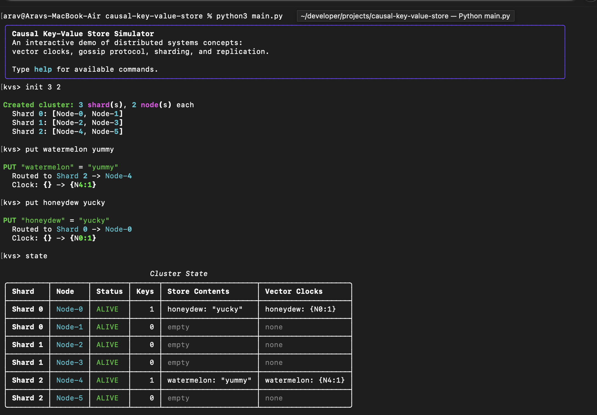

# Distributed Key–Value Store with Causal Consistency



This project implements a distributed, sharded key–value store that provides causal consistency using vector clocks and gossip-based replication. The system supports dynamic view changes, resharding, and fault tolerance through asynchronous communication between nodes.

The code was developed for a distributed systems class. So far, this is my favorite class I've taken so far, and I learned many concepts:
* Potential Causality
* Ordered Delivery (FIFO, Caual, Total Order)
* Clocks (Lamport, Vector)
* Hashing (Consistent Hashing)
* Agreement Problems (Two-phase, Leader Election, Consensus, Failure-detection)
* Replication Protocols (Primary Backup, Chain Replication, Quorum, State-machine)
* Weak Consistency (Eventual, Read-your-writes, Causal)
* Paxos Algorithm

This was the final assignment of the class

After finishing the assignment, I wanted to be able to actually demo the project and show how the system behaves when nodes fail, shards get destroyed, and keys get migrated. I refactored the whole thing into a single-process CLI simulator that lets you test the distributed system interactively from the command line.

---

## How it Works

The same core concepts from the original assignment are preserved — vector clocks, gossip protocol, sharding, causal reads and writes — but instead of running across real network nodes, everything runs in-memory in one process. Gossip runs synchronously after each write operation and also fires automatically on a background timer every 10 seconds, so you can see what propagated where.

### Causal Consistency

Clients attach causal metadata (vector clocks) to every request.

* **Writes** increment the local vector clock and propagate dependencies through gossip
* **Reads** check that the node's clock satisfies the client's causal dependencies before returning
* **Concurrent writes** are resolved deterministically using logical timestamp, then node ID as a tie-breaker

### Gossip Protocol

Two forms of gossip run after every operation:

1. **Local shard gossip:** nodes within the same shard exchange key-value data and vector clocks
2. **Global gossip:** one node per shard shares its clock with one node in every other shard, preserving causality across shard boundaries

### Sharding

Keys are assigned to shards using MD5 hashing mod the total shard count. When you add or remove a shard, the system rehashes all keys and migrates them to their new owners automatically.

---

## Running It

```bash
pip install rich
python3 main.py
```

## Commands

**Data**

| Command | Description |
|---|---|
| `put <key> <value>` | Store a key-value pair |
| `get <key>` | Retrieve a value |
| `delete <key>` | Delete a key (writes a tombstone) |

**Cluster**

| Command | Description |
|---|---|
| `init <shards> <nodes_per_shard>` | Create a cluster |
| `state` | Show the full cluster state |
| `gossip` | Run a manual gossip round |

**Nodes & Shards**

| Command | Description |
|---|---|
| `kill_node <node_id>` | Simulate a node failure |
| `kill_shard <shard_id>` | Kill all nodes in a shard |
| `revive_node <node_id>` | Bring a dead node back online |
| `add_node <shard_id>` | Add a node to a shard |
| `add_shard` | Add a new shard and reshard |
| `remove_shard <shard_id>` | Remove a shard and reshard |
| `reshard <shard_count>` | Change the total number of shards |

**Testing**

| Command | Description |
|---|---|
| `test` | Run the full test suite |

After each operation the simulator prints which shard and node handled the request, how the vector clocks changed, and what gossip propagated. A background gossip round also fires automatically every 10 seconds.

---

## File Structure

```
main.py                 entry point
requirements.txt        dependencies

kvstore/                main package
    clock.py            vector clock operations
    value.py            value data class
    node.py             single node — kv store, clocks, put/get/gossip logic
    shard.py            shard — node collection, local gossip, request routing
    cluster.py          cluster — sharding, global gossip, resharding, fault handling
    display.py          terminal output formatting
    cli.py              interactive REPL

tests/
    tests.py            full test suite
```
